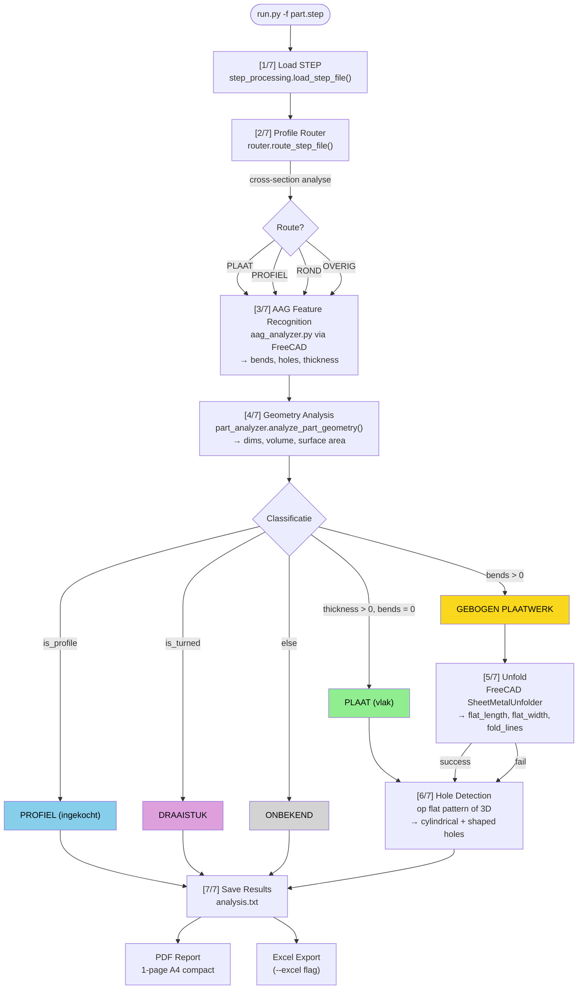
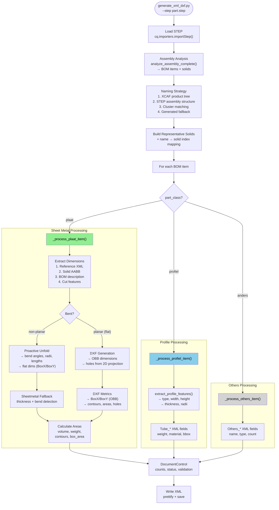
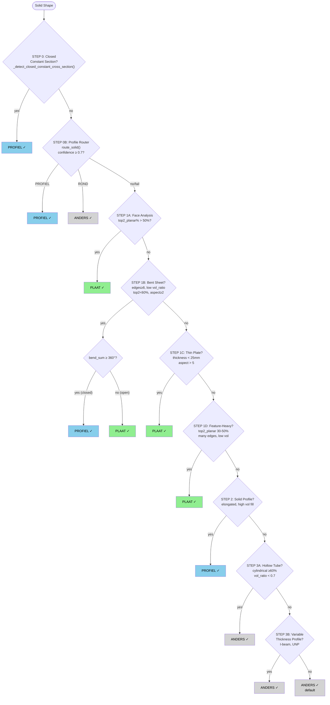

# Manufacturing Pipeline — Complete Flow

## Quick Mode (default)

```mermaid
flowchart TD
    START([run.py -f part.step]) --> LOAD["[1/7] Load STEP<br/>step_processing.load_step_file()"]
    LOAD --> ROUTER["[2/7] Profile Router<br/>router.route_step_file()"]
    ROUTER --> |"cross-section analyse"| ROUTE_RESULT{Route?}
    ROUTE_RESULT --> |PLAAT| AAG
    ROUTE_RESULT --> |PROFIEL| AAG
    ROUTE_RESULT --> |ROND| AAG
    ROUTE_RESULT --> |OVERIG| AAG

    AAG["[3/7] AAG Feature Recognition<br/>aag_analyzer.py via FreeCAD<br/>→ bends, holes, thickness"] --> GEOM

    GEOM["[4/7] Geometry Analysis<br/>part_analyzer.analyze_part_geometry()<br/>→ dims, volume, surface area"] --> CLASSIFY

    CLASSIFY{Classificatie}
    CLASSIFY --> |"bends > 0"| CAT_BENT["GEBOGEN PLAATWERK"]
    CLASSIFY --> |"thickness > 0, bends = 0"| CAT_FLAT["PLAAT (vlak)"]
    CLASSIFY --> |"is_profile"| CAT_PROF["PROFIEL (ingekocht)"]
    CLASSIFY --> |"is_turned"| CAT_TURN["DRAAISTUK"]
    CLASSIFY --> |"else"| CAT_OTHER["ONBEKEND"]

    CAT_BENT --> UNFOLD["[5/7] Unfold<br/>FreeCAD SheetMetalUnfolder<br/>→ flat_length, flat_width, fold_lines"]
    CAT_FLAT --> HOLES
    CAT_PROF --> SAVE
    CAT_TURN --> SAVE
    CAT_OTHER --> SAVE

    UNFOLD --> |"success"| HOLES["[6/7] Hole Detection<br/>op flat pattern of 3D<br/>→ cylindrical + shaped holes"]
    UNFOLD --> |"fail"| HOLES

    HOLES --> SAVE["[7/7] Save Results<br/>analysis.txt"]
    SAVE --> PDF["PDF Report<br/>1-page A4 compact"]
    SAVE --> EXCEL["Excel Export<br/>(--excel flag)"]

    style CAT_BENT fill:#f9d71c,color:#000
    style CAT_FLAT fill:#90EE90,color:#000
    style CAT_PROF fill:#87CEEB,color:#000
    style CAT_TURN fill:#DDA0DD,color:#000
    style CAT_OTHER fill:#D3D3D3,color:#000
```

## XML Export (BOM-based)

```mermaid
flowchart TD
    START([generate_xml_dxf.py<br/>--step part.step]) --> LOAD_STEP["Load STEP<br/>cq.importers.importStep()"]
    LOAD_STEP --> ASSEMBLY["Assembly Analysis<br/>analyze_assembly_complete()<br/>→ BOM items + solids"]

    ASSEMBLY --> NAMING["Naming Strategy<br/>1. XCAF product tree<br/>2. STEP assembly structure<br/>3. Cluster matching<br/>4. Generated fallback"]

    NAMING --> SOLIDS["Build Representative Solids<br/>+ name → solid index mapping"]

    SOLIDS --> LOOP["For each BOM item"]

    LOOP --> CLASS_CHECK{part_class?}

    CLASS_CHECK --> |plaat| PLAAT["_process_plaat_item()"]
    CLASS_CHECK --> |profiel| PROFIEL["_process_profiel_item()"]
    CLASS_CHECK --> |anders| ANDERS["_process_others_item()"]

    subgraph PLAAT_FLOW ["Sheet Metal Processing"]
        PLAAT --> DIMS["Extract Dimensions<br/>1. Reference XML<br/>2. Solid AABB<br/>3. BOM description<br/>4. Cut features"]
        DIMS --> IS_BENT{Bent?}

        IS_BENT --> |"non-planar"| TRY_UNFOLD["Proactive Unfold<br/>→ bend angles, radii, lengths<br/>→ flat dims (BoxX/BoxY)"]
        IS_BENT --> |"planar (flat)"| DXF_GEN["DXF Generation<br/>→ OBB dimensions<br/>→ holes from 2D projection"]

        TRY_UNFOLD --> SM_FALLBACK["Sheetmetal Fallback<br/>thickness + bend detection"]
        DXF_GEN --> METRICS["DXF Metrics<br/>→ BoxX/BoxY (OBB)<br/>→ contours, areas, holes"]

        SM_FALLBACK --> CALC_AREAS["Calculate Areas<br/>volume, weight,<br/>contours, box_area"]
        METRICS --> CALC_AREAS
    end

    subgraph PROF_FLOW ["Profile Processing"]
        PROFIEL --> PROF_FEAT["extract_profile_features()<br/>→ type, width, height<br/>→ thickness, radii"]
        PROF_FEAT --> PROF_XML["Tube_* XML fields<br/>weight, material, bbox"]
    end

    subgraph OTHER_FLOW ["Others Processing"]
        ANDERS --> OTHER_XML["Others_* XML fields<br/>name, type, count"]
    end

    CALC_AREAS --> DOC_CTRL
    PROF_XML --> DOC_CTRL
    OTHER_XML --> DOC_CTRL

    DOC_CTRL["DocumentControl<br/>counts, status, validation"] --> WRITE_XML["Write XML<br/>prettify + save"]

    style PLAAT fill:#90EE90,color:#000
    style PROFIEL fill:#87CEEB,color:#000
    style ANDERS fill:#D3D3D3,color:#000
```

## Classification Decision Tree (classify_solid)

```mermaid
flowchart TD
    INPUT([Solid Shape]) --> STEP0

    STEP0{"STEP 0: Closed<br/>Constant Section?<br/>_detect_closed_constant_cross_section()"}
    STEP0 --> |"yes"| PROFIEL1[PROFIEL ✓]

    STEP0 --> |"no"| STEP0B{"STEP 0B: Profile Router<br/>route_solid()<br/>confidence ≥ 0.7?"}
    STEP0B --> |"PROFIEL"| PROFIEL2[PROFIEL ✓]
    STEP0B --> |"ROND"| ANDERS_R[ANDERS ✓]

    STEP0B --> |"no/fail"| STEP1A{"STEP 1A: Face Analysis<br/>top2_planar% > 50%?"}
    STEP1A --> |"yes"| PLAAT1[PLAAT ✓]

    STEP1A --> |"no"| STEP1B{"STEP 1B: Bent Sheet?<br/>edges≥8, low vol_ratio<br/>top2<60%, aspect≥2"}
    STEP1B --> |"yes"| BEND_CHECK{"bend_sum ≥ 360°?"}
    BEND_CHECK --> |"yes (closed)"| PROFIEL3[PROFIEL ✓]
    BEND_CHECK --> |"no (open)"| PLAAT2[PLAAT ✓]

    STEP1B --> |"no"| STEP1C{"STEP 1C: Thin Plate?<br/>thickness < 25mm<br/>aspect > 5"}
    STEP1C --> |"yes"| PLAAT3[PLAAT ✓]

    STEP1C --> |"no"| STEP1D{"STEP 1D: Feature-Heavy?<br/>top2_planar 30-50%<br/>many edges, low vol"}
    STEP1D --> |"yes"| PLAAT4[PLAAT ✓]

    STEP1D --> |"no"| STEP2{"STEP 2: Solid Profile?<br/>elongated, high vol fill"}
    STEP2 --> |"yes"| PROFIEL4[PROFIEL ✓]

    STEP2 --> |"no"| STEP3A{"STEP 3A: Hollow Tube?<br/>cylindrical ≥60%<br/>vol_ratio < 0.7"}
    STEP3A --> |"yes"| ANDERS1[ANDERS ✓]

    STEP3A --> |"no"| STEP3B{"STEP 3B: Variable<br/>Thickness Profile?<br/>I-beam, UNP"}
    STEP3B --> |"yes"| ANDERS2[ANDERS ✓]

    STEP3B --> |"no"| ANDERS3[ANDERS ✓<br/>default]

    style PLAAT1 fill:#90EE90,color:#000
    style PLAAT2 fill:#90EE90,color:#000
    style PLAAT3 fill:#90EE90,color:#000
    style PLAAT4 fill:#90EE90,color:#000
    style PROFIEL1 fill:#87CEEB,color:#000
    style PROFIEL2 fill:#87CEEB,color:#000
    style PROFIEL3 fill:#87CEEB,color:#000
    style PROFIEL4 fill:#87CEEB,color:#000
    style ANDERS1 fill:#D3D3D3,color:#000
    style ANDERS2 fill:#D3D3D3,color:#000
    style ANDERS3 fill:#D3D3D3,color:#000
    style ANDERS_R fill:#D3D3D3,color:#000
```

## Full Mode Pipeline Stages

```mermaid
flowchart LR
    subgraph GEOMETRY ["Geometry & Topology"]
        S1["load_step"] --> S2["detect_holes"]
        S2 --> S3["geometry_analysis"]
        S3 --> S4["face_analysis"]
        S4 --> S5["topology"]
        S5 --> S6["component_classification"]
        S6 --> S7["detailed_parts"]
    end

    subgraph ISO ["ISO Standards"]
        S8["ISO 2768<br/>tolerances"] --> S9["ISO 286<br/>fits"]
        S9 --> S10["ISO 68-1<br/>threads"]
        S10 --> S11["ISO 13715<br/>edges"]
        S11 --> S12["mass<br/>properties"]
    end

    subgraph OUTPUT ["Analysis & Output"]
        S13["werkvoorbereiding"] --> S14["sheet metal<br/>analysis"]
        S14 --> S15["assembly<br/>BOM"]
        S15 --> S16["cost<br/>estimation"]
        S16 --> S17["PDF<br/>correlation"]
    end

    S7 --> S8
    S12 --> S13
    S17 --> SAVE["Save Results<br/>JSON + DB + PDF"]

    style S1 fill:#FFE4B5,color:#000
    style SAVE fill:#98FB98,color:#000
```
